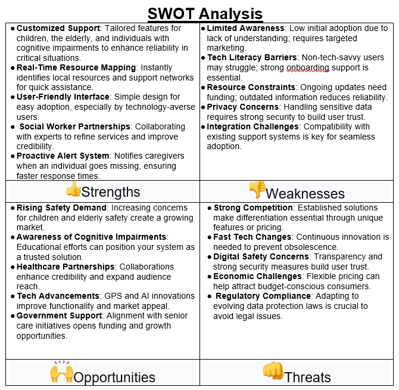

# Smart Restaurant Management App

## Overview
The **Smart Restaurant Management App** is an AI-powered platform that enhances restaurant operations using Generative AI. The system optimizes menu personalization, automates promotions, and streamlines event management through multimodal AI capabilities.

## Features
- **AI-Generated Recipe Suggestions**: Personalized recommendations based on customer preferences.
- **Dynamic Menu Personalization**: Real-time menu updates with visual enhancements.
- **Automated Promotions**: AI-driven discount suggestions based on peak hours and customer behavior.
- **Smart Event Management**: AI-powered scheduling and marketing support.
- **Data Collection & Analysis**: Insights into restaurant performance and customer trends.
- **Chatbot Support**: AI-driven customer interaction for reservations and inquiries.
- **AI-Powered Training Modules**: Training support for chefs and restaurant managers.

## Tech Stack
- **Frontend**: Streamlit, React (optional for UI enhancements)
- **Backend**: Python (FastAPI)
- **AI Model**: Gemini 1.5 Pro

Design Thinking Approach
Empathize: Researching Users' Needs
 Step 1: Empathize and Define

     User Research
1.   Interviews and Observations   :
   -    Participants   : 10 users from different demographics (children, elderly, individuals with cognitive impairments, and their caregivers).
   -    Questions   :
     - What challenges do you face when navigating unfamiliar areas?
     - How do you currently seek help if you feel lost?
     - What features would you find most helpful in an app designed for navigation and emergency support?
   -    Observations   : Simulate scenarios where users might get lost and observe their reactions and decision-making processes.
 

2.    Insights   :
   -    Elderly Users   : Prefer simple interfaces with large buttons and clear instructions.
   -    Children   : Need gamified elements to engage them and keep them focused.
   -    Cognitive Impairments   : Visual cues and minimal text are required to avoid confusion.

     Empathy Mapping
-    Pain Points   :
  - Fear of being lost.
  - Difficulty understanding complex maps.
  - Need for immediate assistance and clear guidance.
-    Desires   :
  - Simple, straightforward navigation.
  - Instant connection to caregivers or emergency services.

Empathy Mapping Insights
Pain Points
1.	Fear of Being Lost: Individuals often experience anxiety and panic when they realize they are lost, which can hinder their ability to think clearly and seek help.
2.	Difficulty Understanding Complex Maps: Traditional maps can be overwhelming and confusing, especially for those who may not be familiar with the area or who have cognitive challenges.
3.	Need for Immediate Assistance and Clear Guidance: In moments of distress, users require quick access to help and straightforward directions to regain their bearings.
Desires
1.	Simple, Straightforward Navigation: Users want an intuitive interface that provides clear, easy-to-follow directions without unnecessary complexity.
2.	Instant Connection to Caregivers or Emergency Services: There is a strong desire for a feature that allows users to quickly reach out for help, whether from friends, family, or emergency services.
 
 SWOT Analysis

Include screenshots and images from your document.

   User Persona Development- Persona Examples:

Persona 1: Sumit, the Elderly User
●	Name: Sumit Patel
●	Age: 70
●	Occupation: Retired Teacher
●	Location: Suburban area
●	Technology Proficiency: Basic (uses a smartphone for calls and messaging)
Background:
Sarah lives alone and enjoys going for walks in her neighborhood and nearby parks. She has a close-knit family who often checks in on her, but she sometimes feels anxious when venturing into unfamiliar areas.
Goals:
●	To feel safe and confident when exploring new places.
●	To easily find her way back home if she gets lost.
●	To communicate her location to her family in case of emergencies.
Pain Points:
●	Struggles with complex navigation apps that have cluttered interfaces.
●	Finds it difficult to read small text and understand complicated maps.
●	Worries about not being able to get help quickly if she feels lost.
Motivations:
●	Values independence and wants to maintain an active lifestyle.
●	Desires peace of mind for herself and her family regarding her safety.
Context of Use:
●	Uses the app primarily when going for walks or visiting new places.
●	Needs the app to be intuitive and easy to navigate, especially in stressful situations.
Quotes:
"I just want an app that tells me where to go without all the fuss. Clear directions and a big button for help would be perfect."
 
________________________________________

Persona 2: Ram, the Caregiver
●	Name: Ram Krishnan
●	Age: 35
●	Occupation: Social Worker
●	Location: Urban area
●	Technology Proficiency: Advanced (frequently uses apps for work and personal use)
Background:
Jake works with elderly clients and individuals with cognitive impairments. He often accompanies them on outings and is responsible for their safety. He is always looking for tools that can help him monitor their well-being and provide immediate assistance if needed.
Goals:
●	To ensure the safety of his clients while they are out in the community.
●	To receive real-time updates on their location and status.
●	To have a quick way to communicate with them in case of emergencies.
Pain Points:
●	Current systems for tracking clients are often outdated and lack real-time capabilities.
●	He feels anxious when clients are out of sight, especially in crowded areas.
●	Needs a reliable way to alert emergency services if a client is in distress.
Motivations:
●	Passionate about helping vulnerable populations and ensuring their safety.
●	Seeks to improve the quality of care and support he provides to his clients.
Context of Use:
●	Uses the app during outings with clients and while monitoring their activities.
●	Needs the app to provide quick access to emergency resources and communication tools.
Quotes:
"I need to know where my clients are at all times. An app that keeps me updated would give me peace of mind."
 
________________________________________

Persona 3: Mia, the Child
●	Name: Mia Johnson
●	Age: 10
●	Occupation: Student
●	Location: Urban area
●	Technology Proficiency: Intermediate (uses a tablet and smartphone for games and educational apps)
Background:
Mia is an adventurous child who loves exploring parks and playgrounds. However, she sometimes gets lost when playing with friends in unfamiliar areas. She enjoys using technology and is familiar with apps designed for kids.
Goals:
●	To find her way back to her parents or a safe place if she gets lost.
●	To have fun while using an app that helps her navigate.
●	To feel empowered and confident when exploring new environments.
Pain Points:
●	Gets overwhelmed by complicated maps and instructions.
●	Needs an app that is engaging and easy to use.
●	Worries about not being able to communicate with her parents if she feels lost.
Motivations:
●	Loves adventure and wants to explore new places safely.
●	Desires independence while still feeling secure.
Context of Use:
●	Uses the app while playing outside or exploring new areas with friends.
●	Needs the app to be visually appealing and gamified to keep her engaged.
Quotes:
"I want an app that can help me find my way back home and is fun to use, like a game!"
 
________________________________________

Persona 4:
●	Name: Smita
●	Age: 75
●	Behavior   : Struggles with traditional GPS navigation.
●	Pain Point   : Needs a simple interface with clear, step-by-step guidance.
 
  

Persona 5:
 

Persona 6:

 

Persona 7:

 

Define
 Based on the empathy mapping insights, the core problems that the app aims to solve are:
●	Users need a way to feel safe and secure when lost.
●	Users require a user-friendly navigation system that simplifies map reading.
●	Users need immediate access to support services.
●	Needed a police station and was guided to the nearest one.
●	Needed medical help and was directed to a nearby hospital.
●	Got lost in a market and received AI chatbot guidance.

   Problem Statement
-    How might we design an intuitive app that helps lost individuals safely navigate unfamiliar areas, connects them to resources, and provides real-time updates to caregivers?   

 

       Step 2: Ideate- Brainstorm potential features and functionalities that could address the defined problems:
     Brainstorming
  Innovative Features   :
  -    Visual SOS Flare   : Sends location and emergency message.
  -    Emergency Resources Widget   : Displays nearby resources.
  -    Multilingual and Accessible Interface   : Supports various languages and audio guidance.

  Unique Concepts
  -    Real-Time Mapping and Navigation   : User-friendly maps with voice guidance.
  -    Caregiver Alerts   : Periodic updates on the user’s location.
  -    Vibration Feedback for Alerts   : Ensures alerts are noticed in noisy environments.
-    User-Friendly Interface: A minimalistic design that highlights essential navigation features.
-    Voice Navigation: Implement voice-guided directions to reduce the need for users to read complex maps.
-    SOS Button: A prominent button that connects users to emergency services or designated contacts with a single tap.
-    Location Sharing: Allow users to share their location with trusted contacts for added security.

 
     

  Step 3: Prototype- A low-fidelity prototype of the app that includes the following key screens:

     Prototype Requirements and Features
1.    Home Screen: Displays the user’s current location and a simple navigation bar.
      Login/Sign-Up and Home Page:-
   - Simple login/sign-up with minimal input.
   The home page shows a map with emergency resources and a prominent SOS button.

2.    Real-Time Navigation : Provides step-by-step voice-guided directions with visual cues :
   - Voice-enabled, step-by-step directions with visual prompts.

3.    Caregiver Alerts   :
   - Sends updates to family members about the user’s location.

4.    Resource Mapping   :
   - Displays resources within a 500-meter radius with color-coded icons.

5.    SOS Alert System   :
   - Emergency flare that shares location and message with caregivers.

6.    Multilingual Support   :
   - Language preferences for diverse users.

7.    Vibration Feedback for Alerts   :
   - Vibration notifications for alerts.

 Step 4: Test

     User Testing
1.    Prototype Testing   :
   - Conduct usability tests with a group of users from the target demographics.
   - Gather feedback on the app’s usability, clarity, and effectiveness in emergencies.

2.    Feedback Collection   :
   - Use surveys and interviews to collect qualitative data on user experience.
   - Identify areas for improvement based on user interactions.

3.    Iterate   :
   - Refine the prototype based on user feedback.
   - Focus on enhancing features that users found confusing or difficult to use.

       
Technologies & Tools used
Napkin.ai
Uizard.ai
Motif.ai
Blackbox.ai
OnlinePersona creator- uxpressia.com/personas-online-tool, user persona.dev/
https://founderpal.ai/swot-analysis-generator
CHAT GPT

________________________________________
Summary of Design Thinking Aspects Covered
1.	Empathize: Each persona reflects the unique experiences and emotions of different user groups, helping the design team understand their needs and challenges.
2.	Define: The personas highlight specific goals and pain points, allowing the team to define the core problems that need to be addressed in the app.
3.	Ideate: Understanding the motivations and contexts of use for each persona can inspire innovative features and solutions tailored to their needs.
4.	Prototype: The personas guide the design of the app's interface and functionalities, ensuring that they are user-friendly and accessible for each target group.
5.	Test: By considering the personas during testing, the team can evaluate how well the app meets the needs of each user group and make necessary adjustments based on feedback.
 
Prototype for app
https://ugrwmfgcmrpfprywnau75t.streamlit.app/
